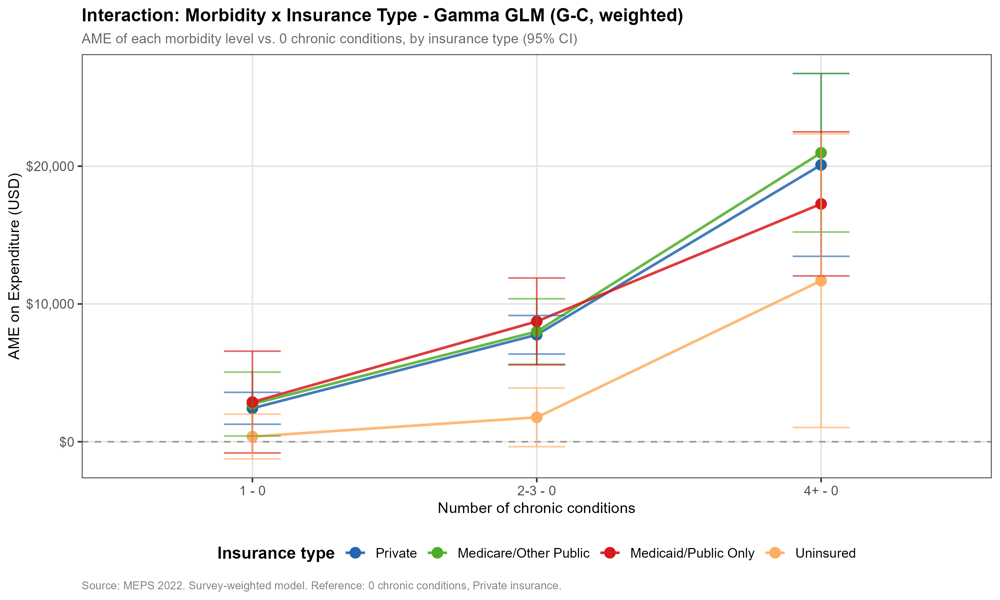

# Who Becomes a High-Cost Healthcare User in the US?

**Insurance type doesn't just shift the average — it bends the slope between illness and spending.**

<p align="center">
  
</p>

Using the 2022 MEPS survey (17,909 US adults), this project measures how clinical complexity translates into healthcare spending across four types of insurance. The interesting finding is not the average difference — it's that the **rate** at which illness becomes spending depends sharply on what insurance you have.

## Headline result

For every standard deviation of additional morbidity:

- **Medicaid** users see their spending grow by **$4,931** — the steepest slope.
- **Private** users see it grow by **$2,723** — about half.
- **Uninsured** users see no statistically significant growth at all. Illness does not become observable spending.

The slope ordering Medicaid > Private > Uninsured holds in **11 of 12** sensitivity tests.

## Why this is non-obvious

- The "uninsured access barrier" lives at the **extensive margin** (whether any care happens), not the intensive margin (how much per visit). Uninsured adults with chronic conditions often record zero spending in a year.
- Medicaid having a steeper slope than Private does *not* mean Medicaid pays more on average. At moderate morbidity, Private is more expensive. Medicaid "responds more"; Private "pays more". Different patterns, both useful for risk adjustment.
- The Wald test on the insurance × morbidity interaction is significant (χ² = 11.04, df = 3, p = 0.012) — not a noisy finding.

## How it works

Survey-weighted **two-part model** on the 2022 MEPS Full-Year Consolidated File:

1. Extensive margin: Pr(any spending) via quasibinomial logit.
2. Intensive margin: E[spending | spending > 0] via Gamma GLM with log link.
3. Custom **AME-weighted morbidity score** built from 8 chronic conditions.
4. Average Marginal Effects via `marginaleffects::avg_slopes` with the delta method.
5. Robustness battery: 4 dimensions × 3 specs = 12 fits.

The cross-sectional design is intentional. Linking to the 2021 wave would shift the question from "who *is* high-cost in 2022" to "who *became* high-cost between 2021 and 2022" — at the cost of losing ~40% of respondents.

## Stack

R · `survey` · `marginaleffects` · `splines` · `gtsummary` · Shiny

## Run it

```bash
Rscript R/_run_all.R
```

For first runs, prefer running each numbered script in `R/` individually.

## More

- **Paper (PDF)**: [`paper/meps_paper.pdf`](paper/meps_paper.pdf)
- **Live dashboard**: https://cmvdata.shinyapps.io/meps-high-cost-users/
- **Markdown summary**: [`docs/analytical_summary.md`](docs/analytical_summary.md)
